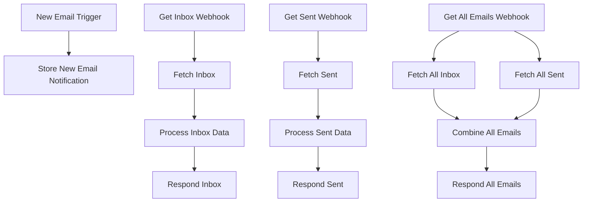

# 🚀 Complete Paragliding Webapp System Documentation

## 📚 System Overview

This document provides a comprehensive overview of all n8n workflows, APIs, components, and integrations in the paragliding web application.

## 🗂️ Table of Contents

1. [N8N Workflows](#n8n-workflows)
   - [Gmail Complete Mail System](#gmail-complete-mail-system)
   - [Pilot Assignment System](#pilot-assignment-system)
   - [Preflight Reminders](#preflight-reminders)
   - [Payment Automation](#payment-automation)

2. [Frontend Components](#frontend-components)
   - [Contact Form](#contact-form)
   - [Booking Forms](#booking-forms)
   - [Dashboard Components](#dashboard-components)

3. [API Endpoints](#api-endpoints)
   - [Contact Form API](#contact-form-api)
   - [Email APIs](#email-apis)
   - [Booking APIs](#booking-apis)

4. [Database Tables](#database-tables)
   - [Contact Submissions](#contact-submissions)
   - [Email Notifications](#email-notifications)
   - [Bookings](#bookings)

5. [Setup Instructions](#setup-instructions)
   - [N8N Configuration](#n8n-configuration)
   - [Supabase Setup](#supabase-setup)
   - [Gmail Integration](#gmail-integration)

---

## 🎯 N8N Workflows

### 📧 Gmail Complete Mail System

**File**: `Gmail-Mail-System-FIXED.json`
**Location**: `n8n-workflows/`

#### **Workflow Purpose**
- Automatic email monitoring and storage
- On-demand email fetching for web app
- Combined inbox/sent email views
- Contact form notification handling

#### **Node by Node Breakdown**

| #  | Node Name | Type | Purpose | Configuration |
|----|-----------|------|---------|--------------|
| 1 | **New Email Trigger** | Gmail Trigger | Monitors inbox every 1 minute for unread emails | Polling: everyMinute, Filter: readStatus=unread |
| 2 | **Store New Email Notification** | Supabase Tool | Saves email metadata to database for notifications | Table: `email_notifications` |
| 3 | **Get Inbox Webhook** | Webhook | Endpoint for fetching inbox emails | Path: `/emails/inbox`, Method: GET |
| 4 | **Fetch Inbox** | Gmail | Retrieves all inbox emails from Gmail API | Operation: getAll, Label: INBOX, Spam: false |
| 5 | **Process Inbox Data** | Code | Transforms Gmail API data to clean format | JavaScript data transformation |
| 6 | **Respond Inbox** | RespondToWebhook | Returns processed inbox data | JSON response with CORS headers |
| 7 | **Get Sent Webhook** | Webhook | Endpoint for fetching sent emails | Path: `/emails/sent`, Method: GET |
| 8 | **Fetch Sent** | Gmail | Retrieves all sent emails from Gmail API | Operation: getAll, Label: SENT, Spam: false |
| 9 | **Process Sent Data** | Code | Transforms sent email data to clean format | JavaScript data transformation |
| 10 | **Respond Sent** | RespondToWebhook | Returns processed sent data | JSON response with CORS headers |
| 11 | **Get All Emails Webhook** | Webhook | Combined inbox and sent emails | Path: `/emails/all`, Method: GET |
| 12 | **Fetch All Inbox** | Gmail | Gets all inbox emails (no unread filter) | Operation: getAll, Label: INBOX |
| 13 | **Fetch All Sent** | Gmail | Gets all sent emails (no unread filter) | Operation: getAll, Label: SENT |
| 14 | **Combine All Emails** | Code | Merges and sorts inbox + sent emails | Sort by date, unified format |
| 15 | **Respond All Emails** | RespondToWebhook | Returns combined email data | JSON array of all emails |

#### **Webhook Endpoints**

```
✉️ Production URLs (when active):
├── /webhook/emails/inbox  → Inbox emails only
├── /webhook/emails/sent   → Sent emails only
└── /webhook/emails/all    → Combined view

🧪 Test URLs (development):
├── /webhook-test/emails/inbox
├── /webhook-test/emails/sent
└── /webhook-test/emails/all
```

#### **Data Flow**



---

### 👨‍✈️ Pilot Assignment System

**Files**: `03-pilot-assignment.json`, `03-pilot-assignment-FREE.json`
**Purpose**: Automates pilot assignment based on availability and experience

**Key Features**:
- Booking detection and automatic pilot matching
- Availability checking against pilot schedules
- Priority assignment based on pilot ratings
- Automated booking updates

---

### ⏰ Preflight Reminders

**Files**: `04-preflight-reminders.json`, `04-preflight-reminders-FREE.json`
**Purpose**: Sends automated reminders before flights

**Key Features**:
- Booking time detection (24h, 6h, 2h before flight)
- SMS and email reminders
- Weather integration for safety warnings
- Pilot and customer notifications

---

### 💳 Payment Automation

**File**: `Payment Automation with Your Ticket API.json`
**Purpose**: Handles payment processing and ticket generation

**Key Features**:
- Payment status monitoring
- Automatic ticket generation on completion
- Receipt emails and confirmations
- Failed payment retry logic

---

## 🎨 Frontend Components

### 📝 Contact Form

**File**: `components/ContactForm.tsx`
**Purpose**: Handles customer inquiries and contact submissions

**Features**:
- Form validation (required fields, email format)
- Loading states and error handling
- Success confirmation with reset
- Submits to `/api/contact` endpoint

**Form Fields**:
- Name (required)
- Email (required, validated)
- Phone (optional)
- Subject (required select dropdown)
- Message (required textarea)

---

### 🗓️ Booking Forms

**Component**: `components/BookingForm.tsx`
**Purpose**: Handles flight booking requests

**Features**:
- Date/time selection
- Participant details
- Tour package selection
- Price calculation
- Integration with booking API

---

### 📊 Dashboard Components

#### **Mail Components**:
- `app/dashboard/mail/page.tsx` - Main email dashboard
- `app/dashboard/mail/compose-page.tsx` - Email composition
- `app/dashboard/mail/test-page.tsx` - Email testing

#### **Conversations**:
- `app/dashboard/conversations/page.tsx` - WhatsApp & SMS conversations
- Integration with messaging APIs

---

## 🔌 API Endpoints

### 📬 Contact Form API

**Endpoint**: `/api/contact`
**Method**: POST
**Purpose**: Processes contact form submissions

**Request Body**:
```json
{
  "name": "string",
  "email": "email@domain.com",
  "phone": "string (optional)",
  "subject": "string",
  "message": "string"
}
```

**Response**:
```json
{
  "success": true,
  "message": "Message sent successfully! We will get back to you soon."
}
```

**Behavior**:
1. Validates required fields and email format
2. Attempts n8n webhook submission
3. Falls back to Supabase storage
4. Stores all submissions regardless

---

### 📧 Email APIs

**Integration**: `/api/emails`
**Method**: GET
**Purpose**: Fetch emails from n8n webhooks

**Query Parameters**:
- `type=inbox` → Inbox emails only
- `type=sent` → Sent emails only
- `type=all` → Combined view (default)

**Response Format**:
```json
{
  "success": true,
  "type": "inbox|sent|all",
  "count": 10,
  "emails": [
    {
      "id": "email_id",
      "threadId": "thread_id",
      "from": "sender@example.com",
      "fromName": "Sender Name",
      "subject": "Email Subject",
      "snippet": "Preview text...",
      "date": "2025-11-22T10:00:00Z",
      "isRead": false,
      "hasAttachment": false,
      "body": "Full email content..."
    }
  ]
}
```

---

### 🗓️ Booking APIs

**Base**: `/api/bookings`
**Endpoints**:
- `GET /api/bookings` - List all bookings
- `POST /api/bookings` - Create new booking
- `GET /api/bookings/[id]` - Get specific booking
- `PUT /api/bookings/[id]` - Update booking
- `DELETE /api/bookings/[id]` - Cancel booking

---

## 🗄️ Database Tables

### 📝 Contact Submissions

**Table**: `contact_submissions`
**Purpose**: Stores all contact form submissions

**Schema**:
```sql
CREATE TABLE contact_submissions (
  id UUID PRIMARY KEY DEFAULT gen_random_uuid(),
  customer_id UUID, -- Optional link to customers
  name TEXT NOT NULL,
  email TEXT NOT NULL,
  phone TEXT,
  subject TEXT NOT NULL,
  message TEXT NOT NULL,
  status TEXT DEFAULT 'new' CHECK (status IN ('new', 'read', 'replied', 'closed', 'spam')),
  priority TEXT DEFAULT 'normal' CHECK (priority IN ('low', 'normal', 'high', 'urgent')),
  -- Assignment fields
  assigned_to UUID,
  assigned_by UUID,
  -- Response tracking
  response TEXT,
  response_by UUID,
  response_at TIMESTAMP WITH TIME ZONE,
  -- Follow-up
  follow_up_required BOOLEAN DEFAULT false,
  follow_up_date TIMESTAMP WITH TIME ZONE,
  follow_up_notes TEXT,
  -- Technical data
  ip_address INET,
  user_agent TEXT,
  referer_url TEXT,
  -- Source tracking
  source TEXT DEFAULT 'contact_form',
  campaign_id TEXT,
  utm_source TEXT,
  utm_medium TEXT,
  utm_campaign TEXT,
  -- Timestamps
  submitted_at TIMESTAMP WITH TIME ZONE DEFAULT NOW(),
  read_at TIMESTAMP WITH TIME ZONE,
  updated_at TIMESTAMP WITH TIME ZONE DEFAULT NOW()
);
```

**Indexes**:
- `idx_contact_submissions_email`
- `idx_contact_submissions_status`
- `idx_contact_submissions_submitted_at`
- `idx_contact_submissions_priority`

---

### 🔔 Email Notifications

**Table**: `email_notifications`
**Purpose**: Stores incoming email alerts

**Schema**:
```sql
-- Connected to n8n Gmail workflow
-- Stores metadata from New Email Trigger
-- For notification system in dashboard
```

---

### 🗓️ Bookings

**Table**: `bookings`
**Purpose**: Main booking management

**Related Tables**:
- `bookings`
- `customers`
- `pilots`
- `tour_packages`
- `conversations`

---

## ⚙️ Setup Instructions

### 🔧 N8N Configuration

#### **1. Gmail OAuth Setup**
```
1. Go to Google Cloud Console
2. Enable Gmail API
3. Create OAuth 2.0 credentials
4. Add authorized redirect URI:
   https://your-n8n-instance.com/rest/oauth2-credential/callback
5. Copy Client ID & Secret to n8n
```

#### **2. Import Workflows**
```
1. Open n8n → Workflows → Add Workflow
2. Click "Import from File"
3. Select fixed workflow JSON files
4. Configure credentials for each node
```

#### **3. Supabase Connection**
```
Credentials in n8n:
- Host: your-project.supabase.co
- Service Role Key: eyJ...secret
```

#### **4. Activate Workflows**
```
1. Configure all credentials (green dots)
2. Click "Active" toggle
3. Test webhook endpoints
```

---

### 🗄️ Supabase Setup

#### **1. Contact Submissions Table**
```sql
-- Run this SQL in Supabase SQL Editor:
-- File: database/CONTACT_SUBMISSIONS_ONLY.sql

-- This creates the contact_submissions table
-- with all necessary indexes and permissions
```

#### **2. Full CRM Schema (Optional)**
```sql
-- Run: database/supabase-crm-tables.sql
-- Creates complete CRM with all tables
-- Note: May have dependency issues if tables missing
```

#### **3. Permissions**
```sql
-- RLS Policies:
-- ✅ Public can INSERT contact submissions
-- ✅ Authenticated users can manage all submissions
```

---

### 📧 Gmail Integration

#### **Webhook URLs for Frontend**
```javascript
// In your web app, call these URLs:
const baseUrl = 'https://your-n8n-instance.com/webhook';

// Get inbox emails
fetch(`${baseUrl}/emails/inbox`)

// Get sent emails
fetch(`${baseUrl}/emails/sent`)

// Get all emails
fetch(`${baseUrl}/emails/all`)
```

#### **Frontend Integration**
```javascript
// Contact form submission
fetch('/api/contact', {
  method: 'POST',
  body: JSON.stringify(formData)
});

// Email API (proxies to n8n)
fetch('/api/emails?type=all');
```

---

## 🔄 Complete System Flow

```
1. User fills contact form
   ↓
2. Form submits to /api/contact
   ↓
3. API stores in Supabase (contact_submissions)
   ↓
4. API triggers n8n webhook (if configured)
   ↓
5. N8n processes and can send emails/notify staff
   ↓
6. Staff sees submissions in dashboard
   ↓
7. Automated follow-ups and responses

Email System:
1. N8n monitors Gmail inbox
   ↓
2. New emails stored in email_notifications
   ↓
3. Dashboard shows notifications
   ↓
4. Web app fetches emails via n8n webhooks
   ↓
5. Users can view/manage emails in dashboard
```

---

## 📁 File Organization

```
n8n-workflows/
├── 📧 Gmail-Mail-System-FIXED.json          # Main email workflow
├── 👨‍✈️ 03-pilot-assignment.json              # Pilot booking automation
├── ⏰ 04-preflight-reminders.json           # Reminder system
├── 💳 Payment Automation with Your Ticket API.json
├── 📚 GMAIL-WORKFLOW-SETUP.md              # Email setup guide
├── 🛠️ IMPORT-INSTRUCTIONS.md               # Workflow setup
└── 📋 COMPLETE_SYSTEM_DOCS.md              # This file

database/
├── 🗄️ supabase-crm-tables.sql              # Full CRM schema
└── 📝 CONTACT_SUBMISSIONS_ONLY.sql         # Contact form table

components/
├── 📝 ContactForm.tsx                      # Contact form component
└── ...other components

app/api/
├── 📬 contact/route.ts                     # Contact form API
└── ...other endpoints

app/dashboard/
├── 📧 mail/                                # Email management
├── 💬 conversations/                       # WhatsApp/SMS
└── ...dashboard sections
```

---

## 🎯 Key Benefits

✅ **Fully Automated** - Email monitoring and notifications
✅ **Integrated CRM** - Contact submissions and customer management
✅ **Scalable** - Webhook-based architecture
✅ **Error Handling** - Multiple fallbacks and validation
✅ **Security** - RLS policies and proper authentication
✅ **Comprehensive** - All business processes automated

---

## 🔧 Troubleshooting

### Common Issues & Solutions

**1. Workflow Not Connected**
- Use `Gmail-Mail-System-FIXED.json` (has connections)
- Delete old workflow, import fixed version

**2. Table Not Found**
- Run `CONTACT_SUBMISSIONS_ONLY.sql` first
- Avoid full CRM schema with dependencies

**3. N8n Rate Limits**
- Configure appropriate polling intervals
- Use webhook caching for performance

**4. Supabase Permissions**
- Check RLS policies are applied
- Verify service role key has permissions

---

## 📞 Support & Development

- **Issues**: Check GitHub repository
- **Updates**: All workflows committed and documented
- **Testing**: Each component has test endpoints
- **Monitoring**: Check n8n execution logs for errors

---

*This documentation covers the complete n8n workflow system, frontend components, APIs, and database structure for the paragliding web application.*
